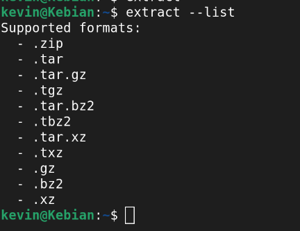

# Extract

An archive extraction tool for linux that supports many file types.
I built this because i didnt like having to use many different ways of extracting when extracting a different file  type like tar in terminal




## Requirements 
-Python 

-Shell

-Any linux distro


## How to install

```bash
git clone https://github.com/Melangert/extract
cd extract
sudo ln -s $(pwd)/extract.sh /usr/local/bin/extract
```

## Commands

```bash
# Extract a file(must be in file directory first)
extract archive.zip

# Extract to a specific directory
extract archive.tar.gz -o ~/Desktop

# Detect format without extracting
extract --detect archive.zip

# List supported extract formqts
extract --list

# Show help
extract --help
```

## currently supported formats

-.zip, .jar, .apk

-.tar, .tar.gz, .tgz

- .tar.bz2, .tbz2
- 
-.tar.xz, .txz
  
-.gz, .bz2, .xz


## Credits
Debugged and edited with claude
